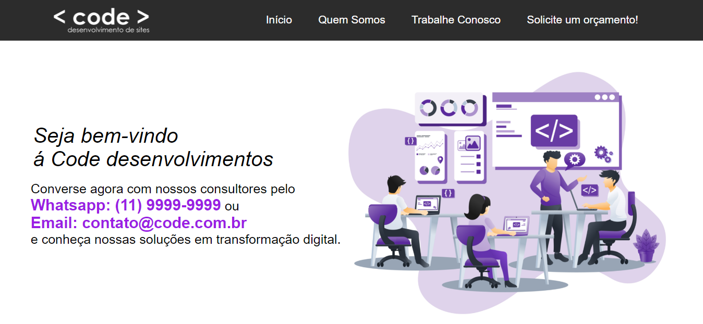

<h1 align="center">
  Primeiro site
</h1>

  

<h4 align="center"><a href="https://evanderinacio.github.io/Primeiro_Site/index.html">Clique para visitar o projeto</a></h4>

---

## Aviso o site não é responsivo

Como foi o primeiro site que criei através do curso da fundação bradesco. O curso por ser muito básico ele não mostrava como fazer um site responsivo para os mais variáveis dispositivos.
  
Por ser o primeiro site que criei com base nos meus conhecimentos naquele momento, não vou alterar em nada a estrutura do projeto.
Apenas irá servir de inspiração para no futuro que eu possa voltar aqui e ver toda a minha evolução na carreira.
